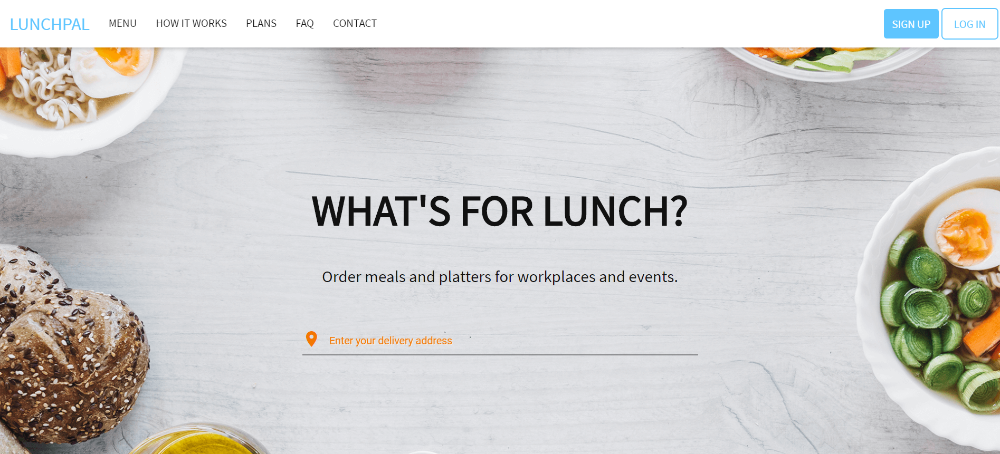

# Lunchpal

Lunchpal is a food delivery and lunch subscription service. It was created to automate daily lunch requirements (mostly for myself) in the South African market but never gained enough traction. Feel free to try to launch it in your region or to adapt the code for a related service. 

# Licence

MIT

# Features

  - Landing pages with clean UI design.
  - Authentication with Firebase.
  - Credit card payment work flows.
  - Meal ordering system.

TODO:
  - Realtime order tracking with map view.
  - View order history.
  - ...

### Screenshots

### Tech
