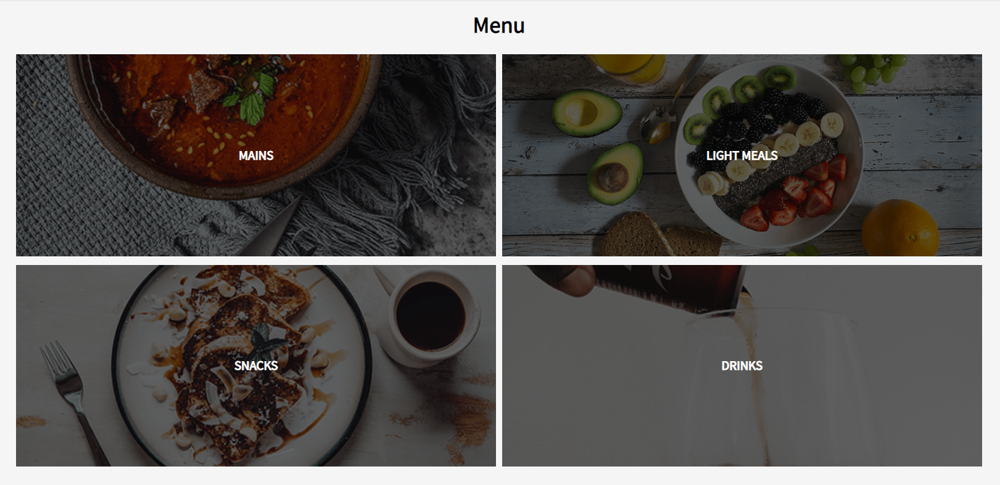
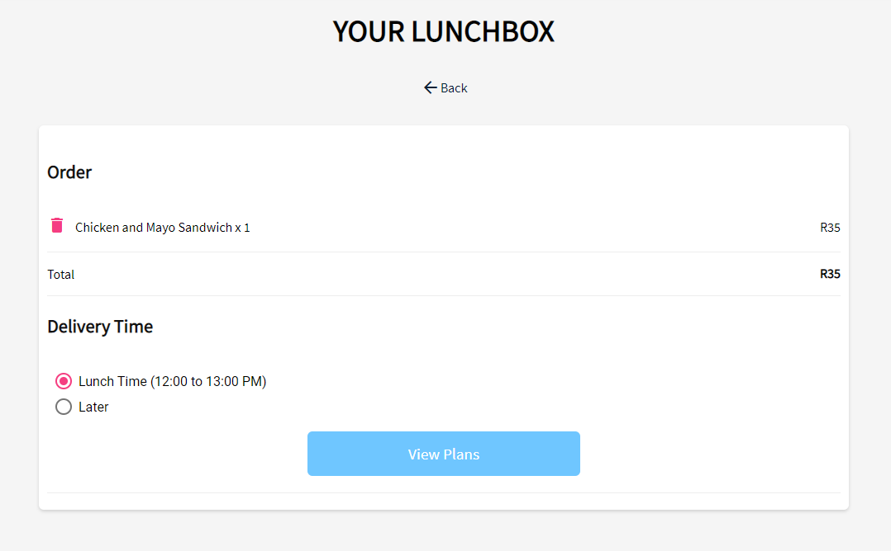

# Lunchpal

Lunchpal is a food delivery and lunch subscription service. It was created to automate daily lunch requirements (mostly for myself) in the South African market but never gained enough traction. Feel free to try to launch it in your region or to adapt the code for a related service. 


# Features
  
  - Cross platform Progressive Web App.
  - Landing pages with clean UI design.
  - Authentication with Firebase.
  - Credit card payment work flows.
  - Meal ordering system.
  - Push notifications.
  - Admin portal for menu management.


TODO:
  - Realtime order tracking with map view.
  - View order history.
  - Any other useful features.


### Screenshots






### Tech
Lunchpal uses a number of open source technologies that are good for rapid prototyping at minimum cost:

* [Angular 6](https://angular.io/) - Front end framework.
* [Bootstrap](https://getbootstrap.com/) - Make HMTL easier.
* [Firebase](https://firebase.google.com/) - Amazing cloud service for authentication, NoSQL database and hosting.
* [NodeJS](https://nodejs.org/) - Server side logic.
* [OneSignal](https://onesignal.com/) - Push notifications.


### Installation

Install the dependencies and devDependencies and start the app using npm.

```sh
$ cd lunchpal
$ npm install
$ npm start
```

### Companion apps

These are the other components associated with this project.

| App | Repo |
| ------ | ------ |
| Admin Portal | https://github.com/rovashan/lunch-admin |
| Server-side API | https://github.com/rovashan/lunch-api |


License
----
MIT
